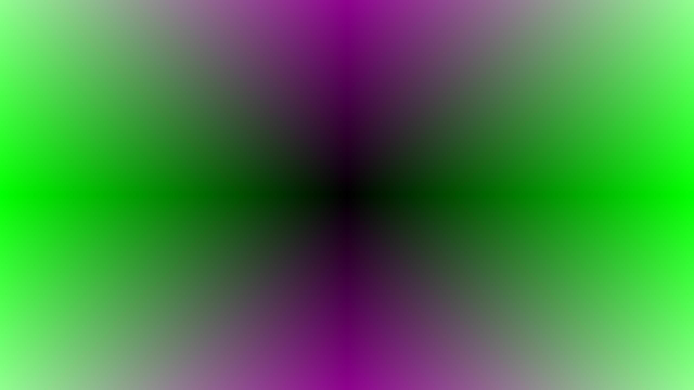
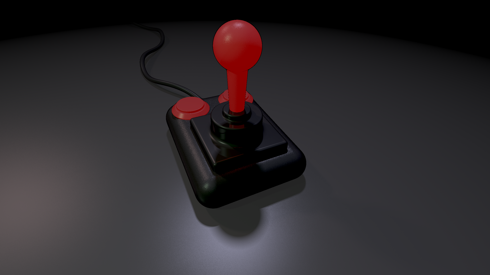

# gtk_4k_template

A 4K exegfx Template for Linux x86_64
Based on Blackles Linux OpenGL examples (GTK) but even smaller. https://github.com/blackle/Linux-OpenGL-Examples

## Tools used to do this production: 
### Shader Minifier http://www.ctrl-alt-test.fr/glsl-minifier/
### smol https://github.com/PoroCYon/smol
### vondehi https://gitlab.com/PoroCYon/vondehi
### oneKpaq https://github.com/temisu/oneKpaq

## Dependencies:
### ibglib2.0-0
### libgtk-3-0
### libgl
### libdispatch (When using oneKpaq)

## Build instructions:
Edit the Makefile and point the Variable called "SHADER" to the desired shader found in the "shaders" folder.
Edit WIDTH and HEIGHT in the Makefile to the resolution of your screen.

### Build LZMA-packed target with a shell script dropper:
  make sh
  
### Build LZMA-packed target with vondehi as dropper:
  make vndh
  
### Build oneKpaq target:
  make okp
  
### Build all three targets:
  make all
    
## Create your own shaders:
Create a new textfile in the shaders subdirectory and edit your shader. No #version directive is needed, "#version 400" is added automaticly. In the shader use i_X and i_Y for screendimensions. Edit WIDTH and HEIGHT in the Makefile for your needs. They will be added by the Makefile while compilation to your shader. So there is no need, to define them yourself. This way we save save some bytes, because we don't need to do a uniform update. If you need a time uniform, use "uniform float iTime;" for runtime in seconds. The uniform update code will be added automaticaly, when this is present in the shader.

If you need a UV, there is automatically genereated a varying called "U". Multiply it by vec2(1,i_Y/i_X), to correct the aspect ratio, if needed.

## Screenshots:
Blackles OpenGL example - Static - Shortest version: 747 Bytes (shelldropper)

Competition - Static - Shortest version: 1987 Bytes (OneKpaq)

Slimebox - Animated - Shortest version: 1545 Bytes (shelldropper)

Quipshade - Animated - Shortest version: 1314 Bytes (shelldropper)

## Have fun!
